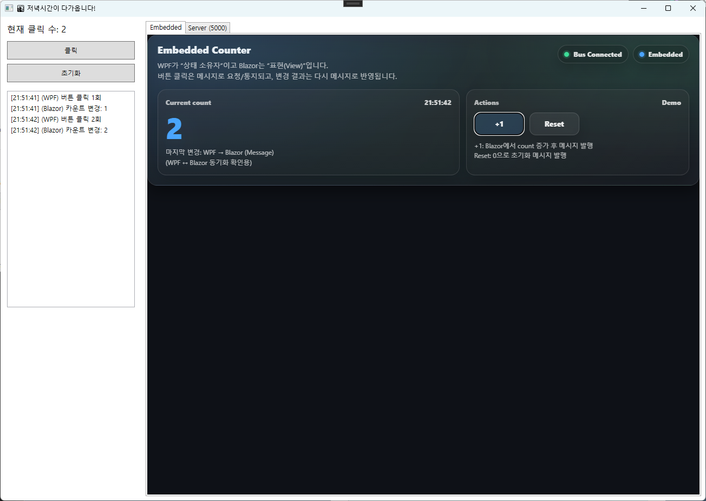
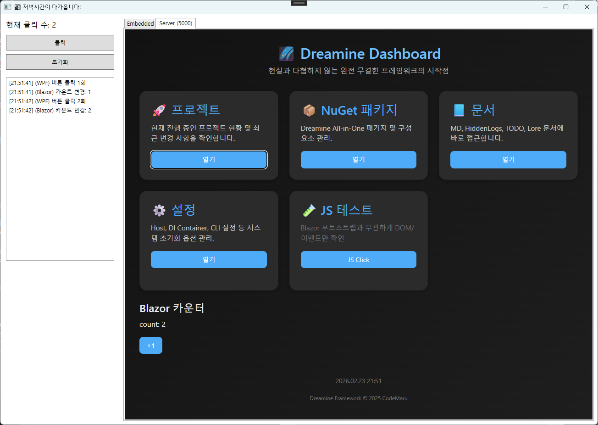
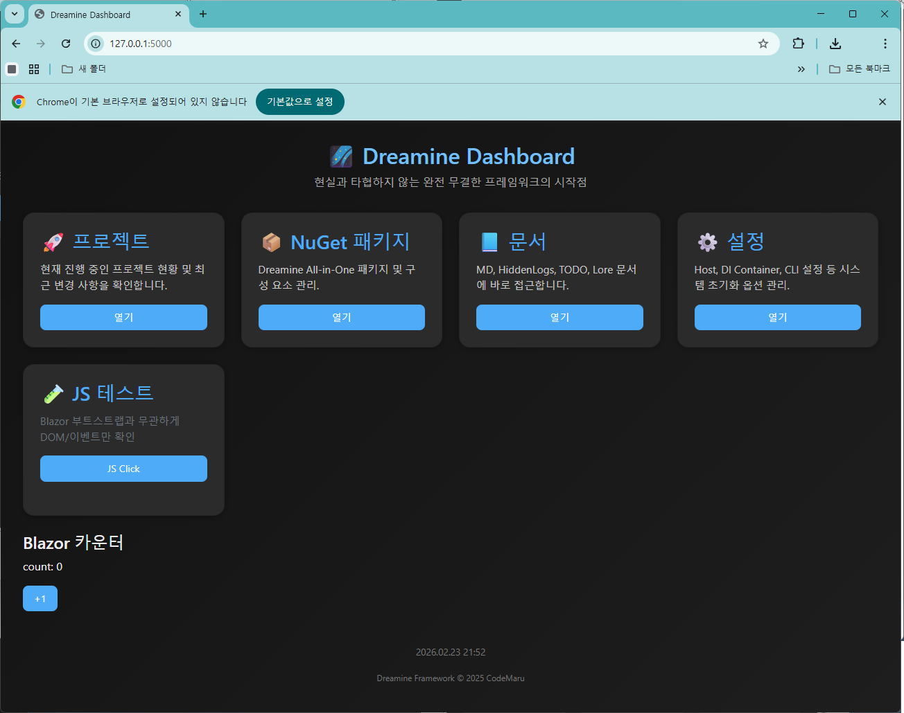

<!--!
\file README.md
\brief Dreamine.Hybrid.Wpf - WPF + BlazorWebView(WebView2) hybrid hosting infrastructure.
\details This README documents architecture, installation, and quick-start usage.
\author Dreamine
\date 2026-02-23
\version 1.0.0
-->

# Dreamine.Hybrid.Wpf

A **production-minded hybrid hosting layer** that embeds **Blazor UI** inside a **WPF** application via **BlazorWebView (WebView2)**, designed for the Dreamine architecture.

[➡️ 한국어 문서 보기](README_ko.md)

---

## Screenshots

### Embedded Mode


### Server Mode (WebView2)


### External Browser Access


---
## What this library is for

If you want to:

- keep your **WPF Shell** (windowing, native controls, device/industrial UI)
- host modern **Blazor components** (dashboard, rich UI, fast iteration)
- integrate in an **MVVM-friendly** way (explicit wiring, no magic)
- avoid common WebView2 pitfalls (cache path issues, init lifecycle)

…then this module is the "hybrid host" piece.

---

## Key Features

- **HybridHostControl**: a WPF `UserControl` that hosts `BlazorWebView`
- **Explicit wiring** (MVVM-friendly): `HostPage`, `RootComponentType`, `RootSelector`, `Services`
- **DI helper**: `AddDreamineHybridWpf()` to register required services in one call
- **Design-time safe**: avoids initializing BlazorWebView in Visual Studio designer
- **WebView2 diagnostics & safe cache path** helper for non-ASCII user profile paths

---

## Requirements

- **.NET**: `net8.0-windows`
- **WPF**: enabled (`<UseWPF>true</UseWPF>`)
- **Packages**:
  - `Microsoft.AspNetCore.Components.WebView.Wpf` 8.x
  - `Microsoft.Web.WebView2` 1.x
- **WebView2 Runtime** installed on the target PC (typically available via Evergreen runtime)

**Project references:**
- `Dreamine.Hybrid` — Core interfaces (e.g. `IHybridMessageBus`)
- `Dreamine.Hybrid.BlazorApp` — Blazor app entry point and ViewModel

---

## Installation

### Option A) Project reference (recommended for now)

Add a project reference to **Dreamine.Hybrid.Wpf** from your WPF shell project.

```xml
<ItemGroup>
  <ProjectReference Include="..\Dreamine.Hybrid.Wpf\Dreamine.Hybrid.Wpf.csproj" />
</ItemGroup>
```

### Option B) (Future) NuGet

If/when published, install via NuGet and proceed with the same Quick Start steps.

---

## Project Structure

```
Dreamine.Hybrid.Wpf/
├── Controls/
│   ├── HybridHostControl.xaml          # UserControl that hosts BlazorWebView
│   └── HybridHostControl.xaml.cs       # Code-behind: wires HostPage, Services, RootComponent
├── Converters/
│   └── BooleanToVisibilityConverter.cs # bool → Visibility converter (singleton)
├── DependencyInjection/
│   └── ServiceCollectionExtensions.cs  # AddDreamineHybridWpf() extension method
├── Internal/
│   └── WebView2Initializer.cs          # Safe WebView2 creation & offline fallback page
├── Utility/
│   └── DesignTimeGuard.cs              # XAML designer detection helper
└── Dreamine.Hybrid.Wpf.csproj
```

---

## Architecture

```
WPF Shell (Window / UserControl)
│
├── HybridHostControl
│   └── BlazorWebView (WebView2)
│       └── Blazor Root Component (e.g. App.razor)
│
└── IHybridMessageBus (InMemoryHybridMessageBus)
    ↔ shared between WPF ViewModels and Blazor components
```

---

## Quick Start

### 1) Register services (DI)

In your WPF app startup (e.g. `App.xaml.cs`):

```csharp
using Dreamine.Hybrid.Wpf.DependencyInjection;
using Microsoft.Extensions.DependencyInjection;
using System;

public partial class App
{
    private IServiceProvider? _services;

    protected override void OnStartup(System.Windows.StartupEventArgs e)
    {
        base.OnStartup(e);

        var services = new ServiceCollection();
        services.AddDreamineHybridWpf();

        _services = services.BuildServiceProvider();

        new MainWindow().Show();
    }

    public IServiceProvider Services => _services
        ?? throw new InvalidOperationException("ServiceProvider is not initialized.");
}
```

> `AddDreamineHybridWpf()` internally calls `AddWpfBlazorWebView()` and registers:
> `IHybridMessageBus → InMemoryHybridMessageBus` (singleton), `IndexViewModel` (singleton).

---

### 2) Place `HybridHostControl` in XAML

```xml
<Window x:Class="Sample.MainWindow"
        xmlns="http://schemas.microsoft.com/winfx/2006/xaml/presentation"
        xmlns:x="http://schemas.microsoft.com/winfx/2006/xaml"
        xmlns:hybrid="clr-namespace:Dreamine.Hybrid.Wpf.Controls;assembly=Dreamine.Hybrid.Wpf"
        Title="Hybrid Shell" Width="1200" Height="800">
    <Grid>
        <hybrid:HybridHostControl x:Name="HybridHost"
                                  HorizontalAlignment="Stretch"
                                  VerticalAlignment="Stretch"/>
    </Grid>
</Window>
```

---

### 3) Wire up at runtime

```csharp
public partial class MainWindow
{
    public MainWindow()
    {
        InitializeComponent();

        HybridHost.HostPage = "wwwroot/index.html";
        HybridHost.RootSelector = "#app";
        HybridHost.RootComponentType = typeof(Dreamine.Hybrid.BlazorApp.App);
        HybridHost.Services = ((App)System.Windows.Application.Current).Services;
    }
}
```

The control auto-initializes on `Loaded` (once only). It throws `InvalidOperationException` if `Services` or `RootComponentType` is not set before load.

---

## Component Reference

### `HybridHostControl`

A WPF `UserControl` that wraps `BlazorWebView`. Configure via properties before the control loads:

| Property | Type | Default | Required | Description |
|---|---|---|---|---|
| `HostPage` | `string` | `"wwwroot/index.html"` | No | Path to the Blazor host HTML file |
| `RootComponentType` | `Type?` | `null` | **Yes** | Blazor root component type |
| `RootSelector` | `string` | `"#app"` | No | CSS selector for the root mount point |
| `Services` | `IServiceProvider?` | `null` | **Yes** | DI container with BlazorWebView registrations |

---

### `WebView2Initializer`

Static utility for low-level WebView2 setup:

| Method | Description |
|---|---|
| `GetSafeUserDataFolder()` | Returns `%LocalAppData%\Dreamine\WebView2Cache` (ASCII-only, auto-created) |
| `CreateConfiguredWebView2()` | Creates a `WebView2` instance with safe cache path and diagnostic event logging |
| `ShowOfflineMessageAsync(webView, url)` | Displays a styled offline warning page if the Blazor server is unreachable |

---

### `BooleanToVisibilityConverter`

Standard `bool → Visibility` converter. Use via singleton in XAML:

```xml
<TextBlock Visibility="{Binding IsVisible,
    Converter={x:Static converters:BooleanToVisibilityConverter.Instance}}" />
```

---

### `DesignTimeGuard`

Exposes `IsInDesignMode` static bool. Useful for XAML triggers or code-behind to suppress runtime logic in the Visual Studio designer.

---

## Design-Time Safety

This library avoids initialization inside the designer:

- `HybridHostControl` checks `DesignerProperties.GetIsInDesignMode(this)` and returns early.
- `DesignTimeGuard.IsInDesignMode` is also available for XAML-side logic.

```xml
<!-- Hide the control in designer to keep XAML editing smooth -->
<hybrid:HybridHostControl
    Visibility="{Binding Source={x:Static local:DesignTimeGuard.IsInDesignMode},
                 Converter={x:Static converters:BooleanToVisibilityConverter.Instance}}"/>
```

---

## WebView2 Safe Cache Path & Diagnostics

If you hit issues with non-ASCII user profile paths (Korean, emoji, etc.), use:

- `WebView2Initializer.GetSafeUserDataFolder()` — forces an ASCII-safe cache directory under `%LocalAppData%`
- `WebView2Initializer.CreateConfiguredWebView2()` — creates a pre-configured instance with `Debug.WriteLine` diagnostics for init and navigation events

---

## Roadmap

- Publish to NuGet (versioning + packaging policy)
- Extend service registration options (logging, cache policy, environment-specific config)
- Provide a "host builder" style bootstrap for WPF shell
- Add more samples (message bus bridge, navigation patterns, ViewModel integration)

---

## License

See `LICENSE`.
